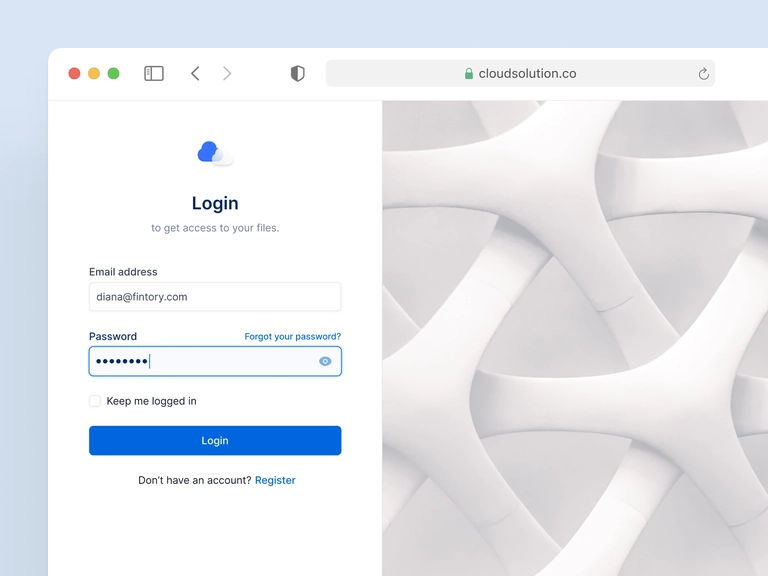

# TODOS 🎯
 

## Develop the general enviroment

  - [x] Define all the `<head>` specifications like `favicon`

  - [x] Set the main responsiveness for the body elements

  - [x] Work on the form element
    - [x] layout
    - [x] style
      - [x] create a synthetic checkbox to emulate a real one
    - [x] functionalities

  - [x] Make a wrapper for the switch mode button

  - [x] Set the media queries for responsive if necessary
   - [ ] It's important to set a specific media for `280px` devices

## Implement the dark mode feature

  - [ ] set the colors
  - [ ] write the logic

 

> Heres the page layout

